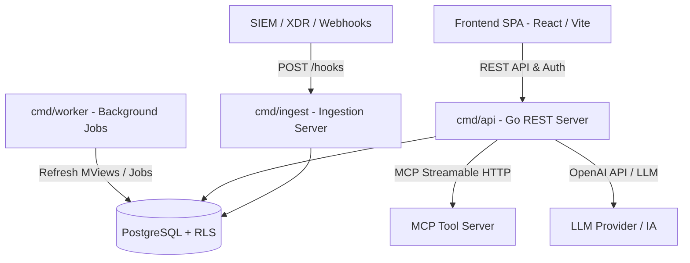

# Plano de Análise e Proposta de Melhorias — ArgusOps

## Visão Geral da Aplicação

O **ArgusOps** é uma plataforma moderna e open-source de gerenciamento de alertas de segurança (SOC) e resposta a incidentes (IRP/SIEM Incident Response). Ela foi projetada com arquitetura Go + PostgreSQL no backend e React + Vite + TypeScript no frontend.

### Componentes Principais



1. **`cmd/api`**: Servidor HTTP REST central responsável pelas regras de negócio (Alertas, Incidentes, Playbooks, Configurações, Usuários, Autenticação Local/LDAP/SAML).
2. **`cmd/ingest`**: Serviço isolado para ingestão de alertas via webhooks de alta volumetria, utilizando tokens rotacionáveis e hash SHA-256.
3. **`cmd/worker`**: Processador de fundo responsável pelo recálculo periódico (1 min) de Views Materializadas (`mv_alert_daily_stats`, `mv_incident_kpis`) para KPIs operacionais (MTTA/MTTR, SLAs).
4. **`frontend/`**: Interface de usuário rica construída em React, TypeScript e Vite com internacionalização (i18n), estatísticas em tempo real, suporte a tema escuro/claro e controle por papel (RBAC/RLS).
5. **`db/`**: Banco PostgreSQL com **Row-Level Security (RLS)** estrito e princípio do menor privilégio através da role `argusops_app`.

---

## Funcionalidades Atuais (Feature Matrix)

| Módulo | Status Atual | Detalhes Técnicos |
| :--- | :--- | :--- |
| **Autenticação & IdP** | ✅ Implementado | Argon2id + JWT RS256, integração LDAP (bind duplo), SAML 2.0 (crewjam/saml) com mapeamento de grupos para roles/tags e obrigatoriedade de troca de senha no 1º login. |
| **Autorização & RLS** | ✅ Implementado | Isolamento por tenant + restrição por tags (`allowedTags`) aplicados tanto no Postgres via RLS quanto no Go Service layer (`access.go`). |
| **Gestão de Alertas** | ✅ Implementado | Ciclo de vida (Open → Investigating → Closed), sugestão automática de Playbooks por palavra-chave, linha do tempo auditável (*append-only*). |
| **Gestão de Incidentes**| ✅ Implementado | Fases NIST 800-61, timestamps originais imutáveis, detecção e auditoria de salto de fases (*phase jumping*), notas de equipe e vínculo N:N com alertas. |
| **Playbooks de SOC** | ✅ Implementado | Biblioteca de procedimentos operacionais organizados por fase NIST e categoria com auto-matching. |
| **Integração IA & MCP** | 🟡 Parcial | Suporte a provedores LLM compatíveis com OpenAI. Cliente **MCP (Model Context Protocol)** funcional sobre HTTP, suporte a aprovação humana para chamadas com efeitos colaterais (`side_effecting_tools`). |
| **Dashboards & KPIs** | ✅ Implementado | Métricas operacionais (MTTA, MTTR, alertas críticos, SLA estourado) calculadas de forma assíncrona no backend via materialized views. |

---

## Diagnóstico do Código e Lacunas Identificadas

Após varredura técnica detalhada no código Go (`backend/internal/`), TypeScript (`frontend/src/`) e SQL (`db/migrations/`), identificaram-se os seguintes pontos de atenção:

### 1. Segurança & Autenticação
* **Falta de Revogação de JWT / Refresh Tokens**: O JWT emitido possui TTL de 15 minutos, mas não há suporte a revogação antecipada (blacklist/Redis) nem par *Access/Refresh Token*. Se um usuário for revogado no painel de Settings, sua sessão ativa permanece válida até o expirar do JWT.
* **Rate Limiting Ausente**: Os endpoints sensíveis `/auth/login`, `/auth/saml/acs` e `/hooks` não possuem rate limiting contra ataques de força bruta ou estouro de cota de ingestão.
* **Secret Store Efêmero**: O `internal/secrets.EnvStore` armazena segredos (senhas de bind LDAP, chaves de API LLM, chaves privadas SAML) apenas em memória ou variáveis de ambiente. Em produção, necessita de integração com Vault / AWS Secrets Manager / KMS.
* **Callback SAML Direct Token**: O endpoint `ServeACS` devolve o token JWT diretamente no corpo do POST de resposta do IdP, padrão menos seguro para SPAs em produção (o recomendado é Authorization Code / cookie efêmero).

### 2. Automação & Inteligência Artificial (Orquestração Agêntica)
* **Agente IA Desconectado das Tools MCP**: O `AIAnalysisService` atual faz chamadas síncronas de texto livre (`Complete`) à LLM. Ele ainda não executa o ciclo agêntico (*Function Calling / Tool Use*) para acionar as ferramentas MCP cadastradas (ex.: consultar Threat Intel no VirusTotal, isolar IP via Firewall, buscar logs no SIEM).
* **Falta de Normalizadores Específicos**: A ingestão possui apenas o `genericNormalizer`. Falta suporte a parsers nativos para plataformas populares (Wazuh, CrowdStrike Falcon, AWS GuardDuty, Microsoft Defender, Datadog).

### 3. Performance & Arquitetura
* **Fetch de Metadata SAML sem Cache**: O `SAMLAuthService.buildServiceProvider` busca o XML de metadados do IdP em toda requisição de login/ACS. Deve haver um cache em memória com TTL e atualização em segundo plano.
* **Validação de `allowedTags` em Sub-Recursos**: Em `IncidentService`, comentários, anexos e links dependem do RLS do PostgreSQL, mas poderiam revalidar `allowedTags` explicitamente na camada Go para maior consistência defensiva.

---

## Proposta Estruturada de Melhorias

Recomendamos a implementação das melhorias organizadas em 3 fases prioritárias:

### Fase 1: Segurança, Estabilidade & Resiliência (Curto Prazo)

> [!IMPORTANT]
> Ações de segurança e governança essenciais para garantir que a aplicação possa operar com segurança em ambientes compartilhados ou corporativos.

1. **Sistema de Rate Limiting (Middleware em Go)**
   - Implementar rate limiter no `backend/internal/httpserver/middleware` utilizando algoritmo Token Bucket ou Leaky Bucket (com Redis ou `golang.org/x/time/rate`).
   - Proteger `/auth/login`, `/auth/saml/*` e `/hooks`.
2. **Mecanismo de Revogação de Sessão & Refresh Tokens**
   - Introduzir tabela `refresh_tokens` no PostgreSQL com revocação por hash e suporte a rotação de tokens.
   - Adicionar checagem de revogação de tokens JWT no middleware `JWTAuth`.
3. **Cache de Metadata SAML**
   - Adicionar cache em memória com mutex e expiração (ex: 1 hora) para o `saml.EntityDescriptor` no `SAMLAuthService`.

### Fase 2: Automação Agêntica de SOC & Ingestão Enriquecida (Médio Prazo)

> [!TIP]
> Eleva o valor operacional do ArgusOps no dia a dia do SOC, automatizando triagem e resposta rápida através do ecossistema MCP e IA.

1. **Loop Agêntico de Triagem com MCP (AI Agent Loop)**
   - Evoluir o `AIAnalysisService` para suportar *Tool Use* iterativo.
   - O agente de IA poderá invocar ferramentas registradas nos servidores MCP (ex: reputação de IP, busca de hashes, enriquecimento de OSINT).
   - Ferramentas marcadas como `side_effecting` geram requisições com status `proposed`, acionando o fluxo de aprovação humana no frontend (`MCP Tool Approvals`).
2. **Parsers Nativos de Ingestão (Wazuh, CrowdStrike, GuardDuty)**
   - Expandir `backend/internal/ingest/` criando adaptadores específicos que implementam a interface `ingest.Normalizer`.
   - Permitir seleção automática do normalizador baseado no cabeçalho ou payload do webhook.
3. **Notificações em Tempo Real (Server-Sent Events - SSE)**
   - Implementar endpoint SSE em `/api/v1/events/stream` para notificar a SPA React sobre novos alertas críticos e mudanças de fase de incidentes sem necessidade de polling manual.

### Fase 3: Governança, Integrações & Escalabilidade (Longo Prazo)

1. **Integração com Vault / KMS para Secrets**
   - Implementar `secrets.VaultStore` e `secrets.AWSKMSStore` conforme a interface `secrets.Store`.
2. **Engine de On-Call / Escalonamento**
   - Conectar o `on_call_shift_service.go` a notificações externas via Webhook/PagerDuty/Slack para alertas de severidade alta/crítica sem atendimento dentro do SLA.
3. **Exportação de Logs de Auditoria SIEM / CEF / Syslog**
   - Endpoint e worker para streaming de eventos de auditoria do ArgusOps para SIEM externo.

---

## Plano de Ação Recomendado / Próximos Passos

1. **Revisão e Validação**: O usuário pode revisar a proposta de melhorias e escolher em qual módulo ou fase deseja focar primeiro.
2. **Implementação Incremental**: Iniciar pela execução das tarefas da **Fase 1** (Rate Limiting e Cache SAML) ou pela evolução da **Fase 2** (Agente MCP / Normalizadores), mantendo 100% de compatibilidade e testes com `task test`.

---

## Plano de Verificação

### Testes Automatizados
- Executar a suíte de validação completa:
  ```bash
  task test
  ```
- Executar o teste de fumaça end-to-end com PostgreSQL e Docker Compose:
  ```bash
  task test:smoke
  ```

### Validação Manual
- Testar endpoints de autenticação e rotas com JWT/RLS.
- Verificar navegação no frontend React (`http://localhost:3000`).
