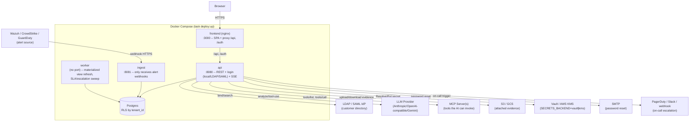

<p align="right"><a href="README.pt-BR.md">🇧🇷 Português</a> · <b>🇺🇸 English</b></p>

<p align="center">
  
</p>

# ArgusOps

SOC/SIEM alert & incident management — Go + PostgreSQL backend, React frontend, designed from the
handoff in `design_handoff_argusops/`. See `backend/README.md`, `frontend/README.md` and
`db/README.md` for details on each part; this README covers how to bring everything up and what to
expect once it's running.

## Requirements

- [Task](https://taskfile.dev) (`go install github.com/go-task/task/v3/cmd/task@latest`)
- Docker + Docker Compose (Postgres, API, ingest, worker, and the frontend all run in containers)
- Go 1.25+, Node 20+ (only needed if you run `backend`/`frontend` outside a container)

## Local deploy (one command)

```bash
task deploy:up
```

This does, in order: brings up Postgres and waits for it to be healthy, applies the migrations
(`db/migrations`), creates the `argusops_app` role (least-privilege — what makes row-level security
worth anything at all, see `db/README.md`), builds the images, and brings up `api` + `ingest` +
`worker` + `frontend`. At the end it prints:

- **Web UI:** http://localhost:3000 (the frontend, served by nginx, already proxying `/api` and
  `/auth` to the backend — this is where you log in)
- **API:** http://localhost:8080 (`AUTH_MODE=dev` by default — see `backend/README.md` before
  exposing this outside your own machine)
- **Ingest (webhooks):** http://localhost:8081

```bash
task deploy:logs   # follow logs for everything
task deploy:down   # tear down (keeps the Postgres volume)
```

For UI development with hot reload (without rebuilding the Docker image on every change):

```bash
task frontend:dev   # :5173, proxies /api and /auth to :8080
```

### First login

Every fresh deploy ships with an admin: **`admin@argusops.local` / `ChangeMe123!`**. The password is
public (it's right here in this repo) on purpose — the first login forces a change before anything
else unlocks, both on screen and in the backend (no route other than changing the password responds
while `mustChangePassword` is set). Change it as soon as you log in.

ArgusOps is designed to run as **a single instance** — there's no "company"/tenant concept at
login. "Company" only exists as a tag on alerts/incidents, used to restrict what each user sees
(`allowedTags`); a single user can have access to alerts from several companies at once.

> `AUTH_MODE=dev` generates a JWT keypair the first time the `api` container starts and persists it
> in `.dev-keys/` (see `backend/README.md`) — sessions stay valid across normal restarts/redeploys.
> A `docker compose down -v` (which also wipes Postgres) removes that volume too.

### What's there once you're logged in

- **Dashboard** — three tabs (Alerts / Incidents / Follow-up), with KPIs computed on the backend
  (not summed from lists in the browser): open/critical alerts, active incidents, breached SLAs, and
  alert/incident **MTTA/MTTR**, plus daily alert and incident volume, and distribution by
  severity/status/priority/phase and by responsible analyst/commander. The averages and volume
  charts come from materialized views (`mv_alert_daily_stats`, `mv_incident_kpis`,
  `mv_incident_daily_stats`) recomputed every 1 minute by the `worker` — if you just closed an
  alert/incident, the number can take up to a minute to catch up, a deliberate trade-off against
  recomputing this on every request. "Live" counters (open, critical) and the recent list/activity
  feed update via SSE, no page reload needed. The time-range filter accepts either a preset
  (24h/7d/30d/90d) or a custom range with exact date and time.
- **Alerts / Incidents** — listing with filters and pagination (`Load more`), a detail view with an
  event timeline, comments, alert↔incident linking, and AI analysis (manual via a button, or
  automatic on ingest if an LLM provider is configured for it). An alert received via webhook can
  carry custom metadata (a Slack channel, an external playbook link, an environment, or any
  key/value the source wants to send), rendered in a dedicated panel on the detail view. See
  [docs/API_INTEGRATION.md](docs/API_INTEGRATION.md) for the full guide on how an external source
  (SIEM/XDR) sends alerts via webhook.
- **Team Roles** (in the incident detail view) — Commander, Technical Lead, Incident Handler(s),
  Communications Lead, and Privacy Officer (NIST 800-61), each assignable to a user.
- **Phase History** (in the incident detail view) — every NIST 800-61 phase records when it was
  entered; the original timestamp is never overwritten. A correction requires a reason, is recorded
  with an author, and produces an entry in the append-only audit log — see
  `db/migrations/0001_initial_schema.up.sql`. Skipping a phase (e.g. New → Eradication directly) isn't
  blocked, but it's flagged with a warning event on the timeline, so poorly-followed process doesn't
  silently skew MTTR metrics.
- **Playbooks** — a library of procedures by category/phase, with automatic suggestions on the alert
  detail view.
- **Settings** (admin) — Webhook Endpoints (token with an expiration/rotation policy — 90 days by
  default, configurable at creation/regeneration), AI Integration (LLM providers, with an option to
  analyze every alert automatically on ingest or only on demand), MCP Servers (with a pending-approvals
  panel for side-effecting tools the AI proposes using), Storage Integration (S3/GCS, for attached
  evidence), SMTP (password-reset emails), Users & Roles, Identity Providers (LDAP/SAML — configure,
  update, and remove), Tags (also auto-created from webhook-ingested alerts), On-Call Schedules,
  Incident SLAs, Escalation Policies (PagerDuty/Slack/generic webhook), Audit Export (CEF), and
  External Database (assisted migration from the bundled Postgres to a customer-managed Postgres).

## Tests

```bash
task test         # build + vet + gofmt + go test + tsc + vite build — no deploy needed
task test:smoke   # brings up the stack (task deploy:up) and runs scripts/smoke-test.sh against it
```

`test:smoke` is the test that actually proves the whole chain works — real Postgres, real RLS, real
JWT, real HTTP —, not just that the code compiles. It logs in as the default admin seeded by the
migration, tests the forced password change, creates a webhook endpoint, ingests an alert through it,
and checks isolation/RLS. Idempotent — it can run again against a deploy that's already run it, but
**it changes the default admin's password** as part of the flow — if you want to keep
`ChangeMe123!` valid for exploring the UI manually afterward, don't run `test:smoke` against that
same deploy (or reset with `docker compose down -v && task deploy:up` afterward). It's not a
complete test suite — it doesn't touch LDAP/SAML or MCP —, it's the smoke test that catches "the
stack doesn't even come up" regressions.

## All tasks

```bash
task --list
```

## Architecture



`api`/`ingest`/`worker` are three separate Go binaries (same module, `cmd/api`, `cmd/ingest`,
`cmd/worker`) so they can scale/fail independently — `ingest` is the only surface exposed to
third-party webhooks (a smaller attack surface, isolated from the rest of the API), `worker` exposes
no port at all (just internal cron). All three connect to Postgres as the same least-privilege role
(`argusops_app`), so row-level security by `tenant_id` applies to any of them, not just requests
coming from the browser — see `db/README.md`. The external components (IdP, LLM, MCP, blob storage,
secrets backend, SMTP, on-call) are all optional and configured per tenant in Settings; with none
configured, the system runs with just local auth + local disk storage + secrets encrypted in
Postgres itself.

### Known limitation: `api` only scales vertically today

Two pieces of `api` hold in-process, in-memory state — `internal/events.Broadcaster` (SSE event
fan-out to connected tabs) and `middleware.NewRateLimiter` (login rate limiting, by IP/account).
That's enough for ArgusOps' single-instance model (see "First login" above — there's no
tenant/company concept at login, so there's never been a reason to run more than one `api`
replica), but it means **running two or more `api` replicas behind a load balancer breaks both**: a
client connected to replica A never receives an event published by replica B (it just misses the
live update until the next manual reload, the data itself stays correct — SSE is only an optional
"something changed" signal, see `internal/events`'s doc comment), and login rate limiting counts
attempts per replica, not in total, so the effective limit multiplies by the number of replicas.

If this ever needs to change: a `Broadcaster` over Redis pub/sub (or NATS) fixes the first one, and
a rate limiter against Redis (`INCR`+`EXPIRE`, a well-known pattern) fixes the second — neither
requires changing the data format or the public API, just swapping the implementation behind the
same interface. It's not a problem today because there's no reason to run more than one replica; it
becomes one the day there is.

## Repository layout

```
backend/    Go: cmd/api, cmd/ingest, cmd/worker + internal/ (domain, repository, service, httpserver, auth)
frontend/   React + Vite + TS
db/         migrations (golang-migrate) + init scripts (least-privilege role)
docs/       logo, openapi.yaml, API_INTEGRATION.md (webhook guide), TROUBLESHOOTING.md, history/ (already-executed plans)
CHANGELOG.md, Taskfile.yml, docker-compose.yml   changelog + local orchestration
```

## Project status and open-source governance

`task test` runs everything that doesn't need a deploy: `go build`/`go vet`/`gofmt` +
`golangci-lint` + `govulncheck` + `go test ./...` on the backend, `tsc --noEmit` + ESLint +
`npm audit` + Vitest + `vite build` on the frontend. Test coverage has its own regression gate
(`task backend:test:coverage-gate`, compared against `backend/coverage-baseline.txt`).
`task test:smoke` brings up the full stack in Docker Compose and validates it end to end (real
Postgres + RLS + JWT + HTTP) — the test that proves the whole chain works, not just that the code
compiles.

Documentation: [CHANGELOG.md](CHANGELOG.md) (what changed and when),
[docs/API_INTEGRATION.md](docs/API_INTEGRATION.md) (how an external SIEM/XDR sends alerts via
webhook), [docs/TROUBLESHOOTING.md](docs/TROUBLESHOOTING.md) (known deploy/testing gotchas),
[docs/openapi.yaml](docs/openapi.yaml) (the `/api/v1/**` API contract — kept in English on purpose,
it's a machine-consumed technical spec, not translated).

See the open-source governance files:
- [LICENSE](LICENSE) (Apache 2.0)
- [SECURITY.md](SECURITY.md) (Security Policy and Vulnerability Disclosure)
- [CONTRIBUTING.md](CONTRIBUTING.md) (Contributing Guide and Workflow)
- [CODE_OF_CONDUCT.md](CODE_OF_CONDUCT.md) (Code of Conduct)
