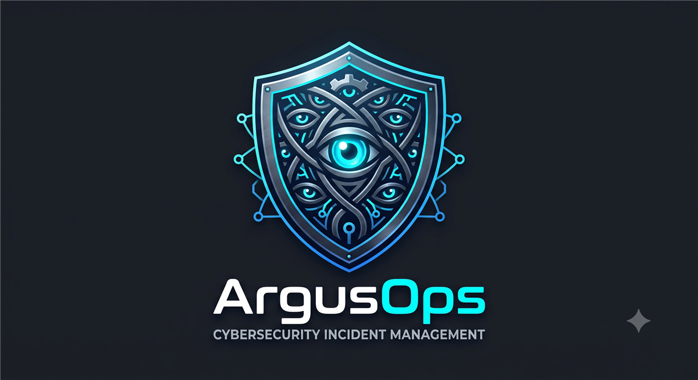
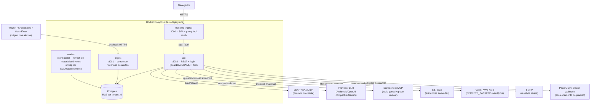

<p align="right"><a href="README.md">🇺🇸 English</a> · <b>🇧🇷 Português</b></p>

<p align="center">
  
</p>

# KuruOps

SOC/SIEM alert & incident management — Go + PostgreSQL backend, React frontend, desenhado a partir
do handoff em `design_handoff_kuruops/`. Ver `backend/README.pt-BR.md`, `frontend/README.pt-BR.md` e
`db/README.pt-BR.md` para detalhes de cada parte; este README cobre como subir tudo e o que esperar
depois que sobe.

## Requisitos

- [Task](https://taskfile.dev) (`go install github.com/go-task/task/v3/cmd/task@latest`)
- Docker + Docker Compose (Postgres, API, ingest, worker e o frontend rodam em container)
- Go 1.25+, Node 20+ (só necessários se for rodar `backend`/`frontend` fora de container)

## Deploy local (um comando)

```bash
task deploy:up
```

Isso faz, nessa ordem: sobe o Postgres e espera ficar saudável, aplica as migrations
(`db/migrations`), cria o role `kuruops_app` (least-privilege — é o que faz a row-level security
valer alguma coisa, ver `db/README.pt-BR.md`), builda as imagens e sobe `api` + `ingest` + `worker` +
`frontend`. No final, imprime:

- **Web UI:** http://localhost:3000 (o frontend, servido por nginx, já com proxy de `/api` e
  `/auth` pro backend — é por aqui que você entra)
- **API:** http://localhost:8080 (`AUTH_MODE=dev` por padrão — ver `backend/README.pt-BR.md` antes de
  expor isso fora da sua máquina)
- **Ingest (webhooks):** http://localhost:8081

```bash
task deploy:logs   # acompanhar logs de tudo
task deploy:down   # derrubar (mantém o volume do Postgres)
```

Para desenvolvimento de UI com hot reload (sem rebuildar a imagem Docker a cada mudança):

```bash
task frontend:dev   # :5173, faz proxy de /api e /auth pro :8080
```

### Primeiro login

Todo deploy novo já vem com um admin: **`admin@kuruops.local` / `ChangeMe123!`**. A senha é
pública (está neste repo) de propósito — o primeiro login força a troca antes de liberar qualquer
outra coisa, tanto na tela quanto no backend (nenhuma rota além de trocar senha responde enquanto
`mustChangePassword` estiver ativo). Troque assim que entrar.

KuruOps é pensado pra rodar como **uma instância só** — não tem conceito de "empresa"/tenant no
login. "Empresa" existe apenas como tag em alertas/incidentes, usada para restringir o que cada
usuário enxerga (`allowedTags`); um mesmo usuário pode ter acesso a alertas de várias empresas ao
mesmo tempo.

> `AUTH_MODE=dev` gera um par de chaves JWT na primeira subida do container `api` e persiste em
> `.dev-keys/` (ver `backend/README.pt-BR.md`) — sessões continuam válidas entre restarts/redeploys
> normais. Um `docker compose down -v` (que também zera o Postgres) apaga esse volume junto.

### O que tem depois de logado

- **Dashboard** — três abas (Alertas / Incidentes / Follow-up), com KPIs computados no backend
  (não somando listas no navegador): alertas abertos/críticos, incidentes ativos, SLA estourado, e
  **MTTA/MTTR** de alertas e incidentes, além de volume de alertas e de incidentes por dia,
  distribuição por severidade/status/prioridade/fase e por analista/commander responsável. As
  médias e os gráficos de volume vêm de materialized views (`mv_alert_daily_stats`,
  `mv_incident_kpis`, `mv_incident_daily_stats`) recalculadas a cada 1 minuto pelo `worker` — se
  você acabou de fechar um alerta/incidente, o número pode levar até um minuto para refletir, é o
  trade-off deliberado de não recalcular isso a cada request. Contadores "ao vivo" (abertos,
  críticos) e a lista/atividade recente atualizam via SSE, sem precisar recarregar a página. O
  filtro de período aceita tanto um preset (24h/7d/30d/90d) quanto um intervalo customizado com
  data e hora exatas.
- **Alertas / Incidentes** — listagem com filtros, busca por texto completo (título/origem/regra/
  ativo para alertas, título/descrição para incidentes, baseada em uma coluna `tsvector` do
  Postgres + índice GIN, não um scan `ILIKE` lento), paginação (`Carregar mais`), e mudança de
  status/fase em massa (selecionar linhas via checkbox, mudar o status de todo alerta ou a fase
  NIST de todo incidente selecionado em uma ação; uma falha parcial reporta resultados por linha, e
  fechamento em massa não é suportado — fechar ainda passa pelo fluxo normal por item), detalhe com
  timeline de eventos, comentários, vínculo alerta↔incidente, e análise por IA (manual via botão,
  ou automática na ingestão se houver um provedor LLM configurado). Um alerta recebido via webhook
  pode carregar metadados customizados (canal do Slack, link de playbook externo, ambiente, ou
  qualquer chave/valor que a fonte quiser mandar), renderizados num painel dedicado no detalhe. Ver
  [docs/API_INTEGRATION.pt-BR.md](docs/API_INTEGRATION.pt-BR.md) para o guia completo de como uma
  fonte externa (SIEM/XDR) envia alertas por webhook.
- **Papéis da Equipe** (no detalhe do incidente) — Commander, Technical Lead, Incident Handler(s),
  Communications Lead e Privacy Officer (NIST 800-61), cada um atribuível a um usuário.
- **Indicadores de Comprometimento** (no detalhe do incidente) — um botão "IOCs" abre um popup
  listando o que já foi cadastrado, com um formulário inline pra adicionar um novo: tipo (de uma
  lista cobrindo os próprios exemplos da NIST SP 800-61r3 mais os tipos de observável STIX 2.1 que a
  NIST SP 800-150 aponta), valor, uma descrição opcional, e a data de identificação. Somente-inserção,
  igual às notas da equipe; puxado automaticamente tanto pro postmortem quanto pro relatório em PDF.
- **Histórico de Fases** (no detalhe do incidente) — cada fase NIST 800-61 registra quando foi
  entrada; o horário original nunca é sobrescrito. Uma correção exige motivo, fica registrada com
  autor, e gera um evento no log de auditoria (append-only) — ver `db/migrations/0001_initial_schema.up.sql`.
  Pular uma fase (ex.: New → Eradication direto) não é bloqueado, mas fica marcado com um evento de
  aviso na timeline, para não mascarar processo mal seguido em métricas de MTTR.
- **Relatórios de Incidente** (no detalhe do incidente) — "Baixar Relatório (PDF)" gera um export de
  um momento específico (severidade/prioridade, timeline de fases com durações, papéis da equipe,
  descrição, tags, alertas vinculados, IOCs, notas da equipe) em qualquer fase; "Gerar Postmortem"
  (oferecido só quando o incidente chega em Pós-Incidente) produz o mesmo registro como um
  documento Markdown, com um resumo executivo gerado por IA quando um provedor LLM está configurado.
- **Playbooks** — biblioteca de procedimentos por categoria/fase, com sugestão automática no
  detalhe do alerta.
- **Settings** (admin) — Webhook Endpoints (token com política de expiração/rotação — 90 dias por
  padrão, configurável na criação/regeneração; dedup opcional por endpoint, suprimindo um alerta
  repetido dentro do `duplicateCount` de um já existente em vez de criar um novo, com base em campos
  JSON-path escolhidos pelo admin dentro de uma janela de tempo configurável; atribuição opcional de
  Field Mapping Template, um catálogo reutilizável de regras JSON-path → label puxadas pro metadata
  do alerta além da extração automática), AI Integration (LLM providers, com opção de
  analisar todo alerta automaticamente na ingestão ou só sob demanda), MCP Servers
  (com painel de aprovações pendentes para tools de efeito colateral que a IA propõe usar),
  Integração de Armazenamento (S3, GCS ou Google Drive — chave de service account ou OAuth — para
  evidências anexadas), SMTP (reset de senha por email), **Conectores** (conectar/desconectar um
  workspace do Slack via OAuth de bot token — fundação para uma integração completa com o Slack; ver
  [docs/SLACK_APP_SETUP.pt-BR.md](docs/SLACK_APP_SETUP.pt-BR.md)), Users & Roles, Identity Providers
  (LDAP/SAML — configurar, atualizar e remover), Tags (também auto-criadas a partir de alertas
  vindos de webhook), Escala de Atendimento, SLAs de Incidentes, Escalonamento de Plantão
  (PagerDuty/Slack/webhook genérico), Log de Auditoria (toda mudança de Configurações que qualquer
  admin fez, em todas as áreas acima -- área, ação, autor, diff antes/depois), Exportação de
  Auditoria (CEF ou JSON), Retenção (por quanto
  tempo alertas/incidentes fechados ficam na ferramenta -- 18 meses por padrão, configurável
  separadamente por tipo de recurso -- antes de serem excluídos permanentemente; nunca toca em
  evidências no armazenamento de blobs) e Banco de Dados Externo (migração assistida do Postgres
  embutido para um Postgres gerenciado pelo cliente).
- **Minha Conta** (autoatendimento, todo usuário) — nome/e-mail/telefone, alteração de senha,
  tokens de API pessoais, e autenticação em dois fatores opcional (TOTP via qualquer aplicativo
  autenticador padrão -- escaneie um QR code ou digite o segredo manualmente, confirme com um código
  de 6 dígitos para ativar; desativar exige a senha atual). Uma conta com 2FA ativado ganha uma
  segunda etapa de login (um código de 6 dígitos) após a verificação de senha.

## Testes

```bash
task test         # build + vet + gofmt + go test + tsc + vite build — não precisa de deploy
task test:smoke   # sobe o stack (task deploy:up) e roda scripts/smoke-test.sh contra ele
```

`test:smoke` é o teste que realmente prova que a cadeia inteira funciona — Postgres real, RLS real,
JWT real, HTTP real —, não só que o código compila. Ele loga como o admin padrão semeado pela
migration, testa a troca de senha obrigatória, cria um webhook endpoint, ingere um alerta por ele e
confere isolamento/RLS. Idempotente — pode rodar de novo contra um deploy que já rodou antes, mas
**troca a senha do admin padrão** como parte do fluxo — se você quer manter `ChangeMe123!` válido
para explorar a UI manualmente depois, não rode `test:smoke` nesse mesmo deploy (ou resete com
`docker compose down -v && task deploy:up` depois). Não é suíte de testes completa — não toca
LDAP/SAML nem MCP —, é o smoke test que pega regressão de "a stack nem sobe".

## Todas as tasks

```bash
task --list
```

## Arquitetura



`api`/`ingest`/`worker` são três binários Go separados (mesmo módulo, `cmd/api`, `cmd/ingest`,
`cmd/worker`) para escalar/falhar independentemente — `ingest` é a única superfície exposta a
webhooks de terceiros (superfície de ataque menor e isolada do resto da API), `worker` não expõe
porta nenhuma (só cron interno). Todos os três conectam no Postgres como o mesmo role
least-privilege (`kuruops_app`), então a row-level security por `tenant_id` vale para qualquer um
deles, não só para requests vindos do navegador — ver `db/README.pt-BR.md`. Os componentes externos
(IdP, LLM, MCP, blobstore, secrets backend, SMTP, on-call) são todos opcionais e configurados por
tenant em Settings; sem nenhum configurado, o sistema roda só com auth local + storage em disco
local + segredos criptografados no próprio Postgres.

### Limitação conhecida: `api` só escala verticalmente hoje

Duas peças do `api` guardam estado em memória, no processo — `internal/events.Broadcaster` (fan-out
de eventos SSE para as abas conectadas) e `middleware.NewRateLimiter` (rate limit de login, por
IP/conta). Isso é suficiente pro modelo single-instance do KuruOps (ver "Primeiro login" acima —
não existe conceito de tenant/empresa no login, então nunca houve razão pra rodar mais de uma
réplica do `api`), mas significa que **rodar duas ou mais réplicas do `api` atrás de um load
balancer quebra os dois**: um cliente conectado à réplica A nunca recebe um evento publicado pela
réplica B (fica sem update ao vivo até o próximo reload manual, os dados continuam corretos — SSE é
só um "algo mudou" opcional, ver `internal/events`'s doc comment), e o rate limit de login conta
tentativas por réplica, não no total, então o limite efetivo multiplica pelo número de réplicas.

Se isso precisar mudar: um `Broadcaster` sobre Redis pub/sub (ou NATS) resolve o primeiro, e um
rate limiter contra Redis (`INCR`+`EXPIRE`, padrão bem conhecido) resolve o segundo — nenhum dos
dois exige mudar o formato dos dados ou a API pública, só trocar a implementação por trás da mesma
interface. Não é um problema hoje porque não há motivo pra rodar mais de uma réplica; vira um
problema no dia em que houver.

## Estrutura do repositório

```
backend/    Go: cmd/api, cmd/ingest, cmd/worker + internal/ (domain, repository, service, httpserver, auth)
frontend/   React + Vite + TS
db/         migrations (golang-migrate) + init scripts (role least-privilege)
docs/       logo, openapi.yaml, API_INTEGRATION.md (guia de webhook), TROUBLESHOOTING.md, history/ (planos já executados)
CHANGELOG.md, Taskfile.yml, docker-compose.yml   changelog + orquestração local
```

## Estado do projeto e Governança Open-Source

`task test` roda tudo que não precisa de deploy: `go build`/`go vet`/`gofmt` + `golangci-lint` +
`govulncheck` + `go test ./...` no backend, `tsc --noEmit` + ESLint + `npm audit` + Vitest + `vite
build` no frontend. Cobertura de teste tem gate próprio contra regressão
(`task backend:test:coverage-gate`, compara contra `backend/coverage-baseline.txt`).
`task test:smoke` sobe a stack completa em Docker Compose e valida ponta a ponta (Postgres real +
RLS + JWT + HTTP) — é o teste que prova que a cadeia inteira funciona, não só que o código compila.

Documentação: [CHANGELOG.pt-BR.md](CHANGELOG.pt-BR.md) (o que mudou e quando),
[docs/API_INTEGRATION.pt-BR.md](docs/API_INTEGRATION.pt-BR.md) (como um SIEM/XDR externo envia
alertas por webhook), [docs/SLACK_APP_SETUP.pt-BR.md](docs/SLACK_APP_SETUP.pt-BR.md) (como criar o
Slack App ao qual a integração Configurações → Conectores → Slack se conecta),
[docs/TROUBLESHOOTING.pt-BR.md](docs/TROUBLESHOOTING.pt-BR.md) (pegadinhas conhecidas do
deploy/testes), [docs/openapi.yaml](docs/openapi.yaml) (contrato da API `/api/v1/**`, em inglês — é
uma especificação técnica consumida por ferramentas, não traduzida de propósito).

Consulte os arquivos de governança open-source:
- [LICENSE](LICENSE) (Apache 2.0)
- [SECURITY.pt-BR.md](SECURITY.pt-BR.md) (Política de Segurança e Vuln Disclosure)
- [CONTRIBUTING.pt-BR.md](CONTRIBUTING.pt-BR.md) (Guia de Contribuição e Workflow)
- [CODE_OF_CONDUCT.pt-BR.md](CODE_OF_CONDUCT.pt-BR.md) (Código de Conduta)
