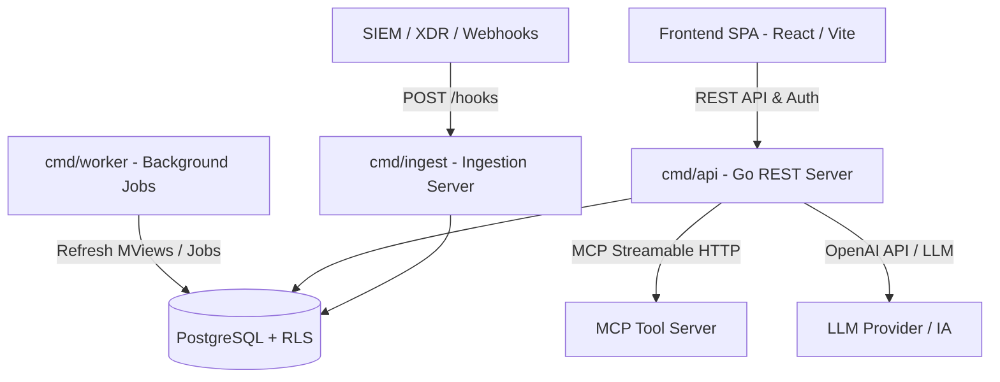

<p align="right"><a href="PLANO_DE_MELHORIAS.pt-BR.md">🇧🇷 Português</a> · <b>🇺🇸 English</b></p>

# Analysis and Improvement Proposal Plan — ArgusOps

> **Status: all 3 phases below have been implemented.** This document is kept as a historical
> record of the diagnosis and the reasoning behind each item — for the current, more precise state
> of each one (what ended up different from what was originally proposed, and what still hasn't
> been validated against real infrastructure), see the "Authentication: what's missing for
> production" and "Resolved since the last review of this document" sections in `backend/README.md`.
> Quick summary of what turned out differently from the original plan:
> - **Phase 1** — rate limiting, refresh tokens/session revocation, and SAML metadata cache: done
>   as described.
> - **Phase 2** — MCP agentic loop, Wazuh/CrowdStrike/GuardDuty normalizers, and SSE: done; however
>   no normalizer has been validated against real traffic from the respective vendor (treat as a
>   starting point).
> - **Phase 3** — Vault/KMS, on-call escalation, and CEF export: done; `VaultStore` has already
>   been validated against a real Vault server (`task backend:test:vault`); `AWSKMSStore` has so
>   far only been tested against a mocked backend (no real AWS account available yet).
> - **Finding outside the original scope**: the default secret store (`EnvStore`) was purely
>   in-memory and lost every credential (LDAP, SAML, LLM, webhook) on every process restart — a
>   real bug discovered during live LDAP/SAML testing, fixed with `PersistentEnvStore` (encrypted,
>   persisted in Postgres). It wasn't listed as a gap in this original document.

## Application Overview

**ArgusOps** is a modern, open-source security alert management (SOC) and incident response
(IRP/SIEM Incident Response) platform. It was designed with a Go + PostgreSQL backend architecture
and a React + Vite + TypeScript frontend.

### Main Components



1. **`cmd/api`**: Central REST HTTP server responsible for business rules (Alerts, Incidents, Playbooks, Settings, Users, Local/LDAP/SAML Authentication).
2. **`cmd/ingest`**: Isolated service for ingesting alerts via high-volume webhooks, using rotatable tokens and SHA-256 hashing.
3. **`cmd/worker`**: Background processor responsible for periodic (1 min) recalculation of Materialized Views (`mv_alert_daily_stats`, `mv_incident_kpis`) for operational KPIs (MTTA/MTTR, SLAs).
4. **`frontend/`**: Rich user interface built with React, TypeScript, and Vite, with internationalization (i18n), real-time statistics, dark/light theme support, and role-based control (RBAC/RLS).
5. **`db/`**: PostgreSQL database with strict **Row-Level Security (RLS)** and the principle of least privilege via the `argusops_app` role.

---

## Current Features (Feature Matrix)

| Module | Current Status | Technical Details |
| :--- | :--- | :--- |
| **Authentication & IdP** | ✅ Implemented | Argon2id + JWT RS256, LDAP integration (double bind), SAML 2.0 (crewjam/saml) with group-to-role/tag mapping and mandatory password change on first login. |
| **Authorization & RLS** | ✅ Implemented | Tenant isolation + tag restriction (`allowedTags`) enforced both in Postgres via RLS and in the Go service layer (`access.go`). |
| **Alert Management** | ✅ Implemented | Lifecycle (Open → Investigating → Closed), automatic Playbook suggestion by keyword, auditable (append-only) timeline. |
| **Incident Management**| ✅ Implemented | NIST 800-61 phases, immutable original timestamps, phase-jump detection and audit, team notes, and N:N linking with alerts. |
| **SOC Playbooks** | ✅ Implemented | Library of operational procedures organized by NIST phase and category with auto-matching. |
| **AI & MCP Integration** | ✅ Implemented | Support for OpenAI-compatible LLM providers. Functional **MCP (Model Context Protocol)** client over HTTP. `AIAnalysisService` runs an iterative agentic loop (tool-use) that calls `ProposeToolCall`; tools with side effects (`side_effecting_tools`) stay in `proposed` status until human approval. Analysis fires automatically on alert ingestion, if an LLM provider is configured. |
| **Dashboards & KPIs** | ✅ Implemented | Operational metrics (MTTA, MTTR, critical alerts, breached SLA, alert/incident volume per day) computed asynchronously in the backend via materialized views; period filter by preset or custom range (date + time). |

---

## Code Diagnosis and Identified Gaps

After a detailed technical scan of the Go code (`backend/internal/`), TypeScript (`frontend/src/`), and SQL (`db/migrations/`), the following points of attention were identified:

### 1. Security & Authentication
* **Lack of JWT Revocation / Refresh Tokens**: The issued JWT has a 15-minute TTL, but there's no support for early revocation (blacklist/Redis) nor an Access/Refresh Token pair. If a user is revoked in the Settings panel, their active session remains valid until the JWT expires.
* **Missing Rate Limiting**: The sensitive endpoints `/auth/login`, `/auth/saml/acs`, and `/hooks` have no rate limiting against brute-force attacks or ingestion quota overflow.
* **Ephemeral Secret Store**: `internal/secrets.EnvStore` stores secrets (LDAP bind passwords, LLM API keys, SAML private keys) only in memory or environment variables. In production, it needs integration with Vault / AWS Secrets Manager / KMS.
* **SAML Direct Token Callback**: The `ServeACS` endpoint returns the JWT token directly in the body of the IdP's response POST, a less secure pattern for SPAs in production (the recommended approach is Authorization Code / ephemeral cookie).

### 2. Automation & Artificial Intelligence (Agentic Orchestration)
* **AI Agent Disconnected from MCP Tools**: The current `AIAnalysisService` makes synchronous free-text calls (`Complete`) to the LLM. It doesn't yet run the agentic cycle (Function Calling / Tool Use) to invoke registered MCP tools (e.g., querying Threat Intel on VirusTotal, isolating an IP via Firewall, searching logs in the SIEM).
* **Lack of Specific Normalizers**: Ingestion only has the `genericNormalizer`. Native parsers for popular platforms (Wazuh, CrowdStrike Falcon, AWS GuardDuty, Microsoft Defender, Datadog) are missing.

### 3. Performance & Architecture
* **SAML Metadata Fetch without Cache**: `SAMLAuthService.buildServiceProvider` fetches the IdP's metadata XML on every login/ACS request. There should be an in-memory cache with TTL and background refresh.
* **`allowedTags` Validation on Sub-Resources**: In `IncidentService`, comments, attachments, and links rely on PostgreSQL's RLS, but could explicitly revalidate `allowedTags` at the Go layer for stronger defensive consistency.

---

## Structured Improvement Proposal

We recommend implementing the improvements organized into 3 priority phases:

### Phase 1: Security, Stability & Resilience (Short Term)

> [!IMPORTANT]
> Essential security and governance actions to ensure the application can operate safely in shared or corporate environments.

1. **Rate Limiting System (Go Middleware)**
   - Implement a rate limiter in `backend/internal/httpserver/middleware` using a Token Bucket or Leaky Bucket algorithm (with Redis or `golang.org/x/time/rate`).
   - Protect `/auth/login`, `/auth/saml/*`, and `/hooks`.
2. **Session Revocation & Refresh Token Mechanism**
   - Introduce a `refresh_tokens` table in PostgreSQL with hash-based revocation and token rotation support.
   - Add JWT revocation checking to the `JWTAuth` middleware.
3. **SAML Metadata Cache**
   - Add an in-memory cache with mutex and expiration (e.g., 1 hour) for the `saml.EntityDescriptor` in `SAMLAuthService`.

### Phase 2: SOC Agentic Automation & Enriched Ingestion (Medium Term)

> [!TIP]
> Raises ArgusOps's day-to-day operational value for the SOC, automating triage and rapid response through the MCP and AI ecosystem.

1. **MCP Agentic Triage Loop (AI Agent Loop)**
   - Evolve `AIAnalysisService` to support iterative Tool Use.
   - The AI agent will be able to invoke tools registered on MCP servers (e.g., IP reputation, hash lookup, OSINT enrichment).
   - Tools marked as `side_effecting` generate requests with `proposed` status, triggering the human approval flow in the frontend (`MCP Tool Approvals`).
2. **Native Ingestion Parsers (Wazuh, CrowdStrike, GuardDuty)**
   - Expand `backend/internal/ingest/` by creating specific adapters that implement the `ingest.Normalizer` interface.
   - Allow automatic normalizer selection based on the webhook's header or payload.
3. **Real-Time Notifications (Server-Sent Events - SSE)**
   - Implement an SSE endpoint at `/api/v1/events/stream` to notify the React SPA about new critical alerts and incident phase changes without manual polling.

### Phase 3: Governance, Integrations & Scalability (Long Term)

1. **Vault / KMS Integration for Secrets**
   - Implement `secrets.VaultStore` and `secrets.AWSKMSStore` per the `secrets.Store` interface.
2. **On-Call / Escalation Engine**
   - Connect `on_call_shift_service.go` to external notifications via Webhook/PagerDuty/Slack for high/critical severity alerts not handled within the SLA.
3. **SIEM Audit Log Export / CEF / Syslog**
   - Endpoint and worker to stream ArgusOps audit events to an external SIEM.

---

## Recommended Action Plan / Next Steps

1. **Review and Validation**: The user can review the improvement proposal and choose which module or phase to focus on first.
2. **Incremental Implementation**: Start by executing **Phase 1** tasks (Rate Limiting and SAML Cache) or by evolving **Phase 2** (MCP Agent / Normalizers), maintaining 100% compatibility and passing tests with `task test`.

---

## Verification Plan

### Automated Tests
- Run the full validation suite:
  ```bash
  task test
  ```
- Run the end-to-end smoke test with PostgreSQL and Docker Compose:
  ```bash
  task test:smoke
  ```

### Manual Validation
- Test authentication endpoints and routes with JWT/RLS.
- Verify navigation in the React frontend (`http://localhost:3000`).
